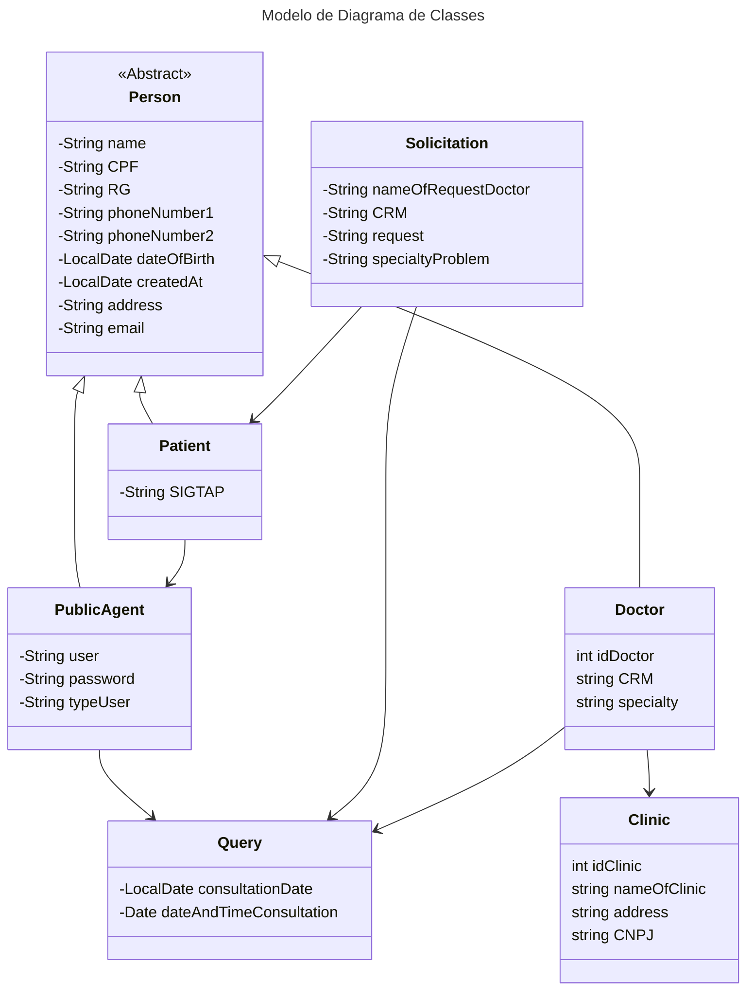
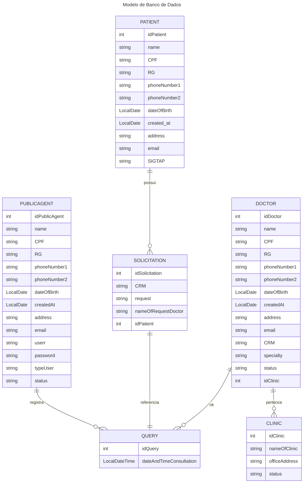

# **Agenda Dendê**

Este projeto foi desenvolvido como avaliação da disciplina de *Linguagem de Programação II*. A Agenda Dendê é um sistema de marcação de consultas que possui como objetivo principal informatizar o processo de marcação e agendamento de consultas médicas. Tornando fácil requisitar a marcação de consultas e agendamento da mesmas.

## Minimundo e Fluxo de uso

### Motivação

A central de marcação da cidade X realiza a marcação de consultas de saúde da população com bastante afinco, entretanto todos os seus processos ainda são manuais, dificultando a organização das informações dos pacientes atendidos pela central. Todos os registros são em papeis, todavia, a secretária da saúde da cidade X deseja automatizar todo esse sistema, seja no cadastro dos cidadãos, atualização dos dados dos pacientes, marcação/agendamento de consultas e até a comunicação com os cidadãos atendidos.

### Problemas Identificados:

1. Processos Manuais: A central de marcação de consultas depende inteiramente de registros em papel, o que torna a coleta, armazenamento e atualização de dados um processo lento e propenso a erros.

2. Dificuldades de Organização: O uso de métodos manuais dificulta a organização eficiente das informações dos pacientes, resultando em atrasos no agendamento, sobreposição de consultas e dificuldades na localização de registros.

3. Falta de Comunicação Eficiente: A comunicação entre a central e os pacientes atendidos é limitada e muitas vezes ineficaz, resultando em dificuldades na confirmação de consultas, lembretes e informações sobre procedimentos.

### Objetivos da Automatização:

1. A Secretaria de Saúde da cidade X reconhece a necessidade urgente de modernizar e automatizar o sistema da central de marcação de consultas. Os principais objetivos da automatização incluem:

2. Eficiência Operacional: Implementar um sistema automatizado para simplificar e agilizar os processos de cadastro de cidadãos, atualização de dados dos pacientes e marcação/agendamento de consultas.

3. Organização e Gestão de Dados: Garantir uma gestão eficaz das informações dos pacientes, permitindo um acesso rápido e preciso aos registros, evitando sobreposições de consultas e melhorando a eficiência geral da central.

4. Comunicação Aprimorada: Estabelecer canais de comunicação mais eficazes entre a central e os pacientes, permitindo a confirmação de consultas, envio de lembretes, notificações sobre resultados de exames e outras informações relevantes de forma oportuna e conveniente.

### Das Funcionalidades

O sistema deverá:

1. Gerenciar pacientes
2. Gerenciar agentes públicos
3. Solicitar marcação de consultas
4. Confirmar agendamento de consultas
5. Relatório de consultas

### Dos Menus:

#### Menus (Normal)

**Login**

1. Usuário
2. Senha
3. Login

**Menu Inicial**

1. Pacientes
2. Consultas

**Menu Gerenciar Pacientes**

1. Consultar paciente
2. Cadastrar paciente
3. Atualizar dados dos pacientes

**Menu Agendamento**

1. Agendar consulta
2. Confirmar consulta

#### Menus (Admin: +2 telas e +2 opções no menu inicial)

**Menu Inicial**
1. Pacientes
2. Consultas
3. Relatorio
4. Gerenciar usuários

**Relatórios(Admin)**
1. Gerar relatório
2. Aplicar filtro

**Gerenciar usuários**
1. Adicionar
2. Editar
3. Buscar

### Diagrama de Classes

### Diagrama de Banco de Dados
